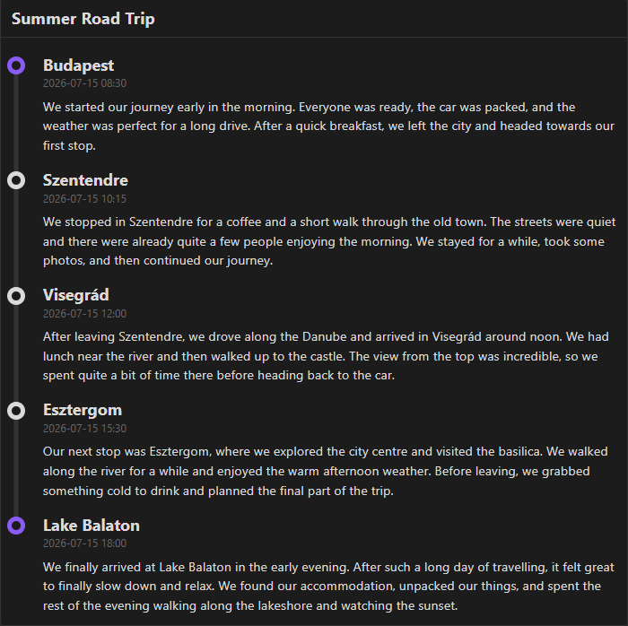

# Obsidian Trip Planner

This Obsidian plugin makes it easy to create plans for trips.

## Features

* Create trip timelines using a simple `trip` code block.
* Display a trip title.
* Add start, stop, and destination events.
* Display the location of each event.
* Display the date and time of each event.
* Add descriptions to events.
* Automatically create a visual timeline connecting the events.
* Works with Obsidian's light and dark themes.

## Usage

To use the plugin, create a `trip` code block.

After creating the block, you can define the title. This can be done with a simple line:

`title: {title}`

After setting the title, you can define three types of stops:

* **start**

  * Marks the beginning of a trip.

* **stop**

  * Marks a temporary stop during the trip.

* **destination**

  * Marks the final destination.

For each stop, you can define three values:

* `date`
* `location`
* `description`

Each value has to be indented under its corresponding stop and written in the same format as the title.

### Example

````markdown
```trip
- title: Summer Road Trip

- start:
  - date: 2026-07-15 08:30
  - location: Budapest
  - description: We started our journey early in the morning. Everyone was ready, the car was packed, and the weather was perfect for a long drive. After a quick breakfast, we left the city and headed towards our first stop.

- stop:
  - date: 2026-07-15 10:15
  - location: Szentendre
  - description: We stopped in Szentendre for a coffee and a short walk through the old town. The streets were quiet and there were already quite a few people enjoying the morning. We stayed for a while, took some photos, and then continued our journey.

- stop:
  - date: 2026-07-15 12:00
  - location: Visegrád
  - description: After leaving Szentendre, we drove along the Danube and arrived in Visegrád around noon. We had lunch near the river and then walked up to the castle. The view from the top was incredible, so we spent quite a bit of time there before heading back to the car.

- stop:
  - date: 2026-07-15 15:30
  - location: Esztergom
  - description: Our next stop was Esztergom, where we explored the city centre and visited the basilica. We walked along the river for a while and enjoyed the warm afternoon weather. Before leaving, we grabbed something cold to drink and planned the final part of the trip.

- destination:
  - date: 2026-07-15 18:00
  - location: Lake Balaton
  - description: We finally arrived at Lake Balaton in the early evening. After such a long day of travelling, it felt great to finally slow down and relax. We found our accommodation, unpacked our things, and spent the rest of the evening walking along the lakeshore and watching the sunset.
```
````



## Installation

The plugin can be downloaded from the official Obsidian plugin store.
